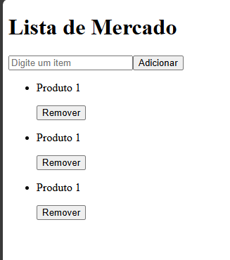

Vamos lá

1° Passo:
Adicionar tags HTML ao código
<input> / <button> / 
 / <ul> / <li>:

2° Passo:
Separar o conteúdo de cada página em componentes. Nesse caso, teremos que criar um arquivo separando a lista (<li>) do arquivo App.jsx

Nesse arquivo, escreva "rafce" para criar um componente padrão (possível apenas com extensão (ES7))

Traga o código <li> para esse arquivo:

import React from "react";

const itemLista = () => {
return (

<li>

Produto 1

<button>Remover</button>
</li>

);
};

export default itemLista;

3° Passo:
Mapear a lista
No Arquivo App.jsx, em cima do return crie o seguinte Array:

const listaMercado = ["banana", "maça", "carne"];

Para que seja possível renderizar cada item dessa lista, devemos mapear primeiramente ela.
Então, dentro da tag <ul> iremos fazer assim:
{} // entre chaves pois estamos escrevendo javaScript
{listaMercardo.map( (itemLista) => (
<ItemLista />
))}

Então aqui eu criei um código que irá mapear a lista:
() => () é uma função

Ao fazer isso, é para aparecer a seguinte tela:

Então agora, se você adicionar qualquer outro produto dentro do Array automaticamente mais um ItemLista irá aparecer para você na tela renderizada na web
