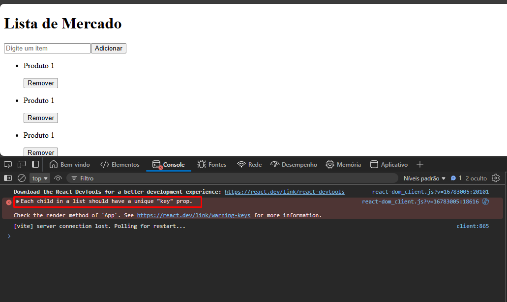

Vamos lá

1° Passo:
Adicionar tags HTML ao código
<input> / <button> / 
 / <ul> / <li>:

2° Passo:
Separar o conteúdo de cada página em componentes. Nesse caso, teremos que criar um arquivo separando a lista (<li>) do arquivo App.jsx

Nesse arquivo, escreva "rafce" para criar um componente padrão (possível apenas com extensão (ES7))

Traga o código <li> para esse arquivo:

import React from "react";

const itemLista = () => {
return (

<li>

Produto 1

<button>Remover</button>
</li>

);
};

export default itemLista;

3° Passo:
Mapear a lista
No Arquivo App.jsx, em cima do return crie o seguinte Array:

const listaMercado = ["banana", "maça", "carne"];

Para que seja possível renderizar cada item dessa lista, devemos mapear primeiramente ela.
Então, dentro da tag <ul> iremos fazer assim:
{} // entre chaves pois estamos escrevendo javaScript
{listaMercardo.map( (itemLista) => (
<ItemLista />
))}

Então aqui eu criei um código que irá mapear a lista:
() => () é uma função

Ao fazer isso, é para aparecer a seguinte tela:

Então agora, se você adicionar qualquer outro produto dentro do Array automaticamente mais um ItemLista irá aparecer para você na tela renderizada na web

Se você clicar F12 e ir em console vai ver que tem um erro na tela:

Isso acontece porque é necessário que cada item da lista tenha um único identificador, como se fosse uma primary key em banco de dados. E é aqui que vamos começar a usar as Props

4° Passo:
Para adicionarmos uma key para cada elemento, temos que fazer dessa maneira:
key = {nomeDaKey}
No nosso caso ficará assim:
{listaMercado.map((itemLista, index) => (
<ItemLista key={index} />
))}

Por quê? Porque o index sendo a key, o sistema pega diretamente a posição de cada item na lista, e não o seu valor propriamente dito. Quer dizer que quanto mais itens eu tiver, ou menos eu tiver, ele leva em consideração cada posição que existe na lista, se tem mais posição ele aumenta gradualmente, se tem menos ele diminui, assim por diante...
E se colocassemos itemLista?
Daria certo SE cada item na lista fosse diferente, se tiver algum igual da erro

Porém ainda os produtos continuam repetidos (Produto 1), devemos mostrar todos os itens da lista. Para isso teremos que usar os parâmetros em outro aquivo.

Atualmente temos o arquivo ItemLista dessa forma:

import React from "react";

const itemLista = () => {
return (

<li>

Produto 1

<button>Remover</button>
</li>

);
};

export default itemLista;

Aqui ele está sem anda dentro dos () da função. É nesse campo que colocaremos o parâmetro itemLista, pois iremos usar esse parâmetro, com o mesmo nome, lá no arquivo App.jsx, dessa forma:

{listaMercado.map((itemLista, index) => (
<ItemLista key={index} itemLista={itemLista} />
))}

Por quê dessa forma? Porque os props também são objetos
